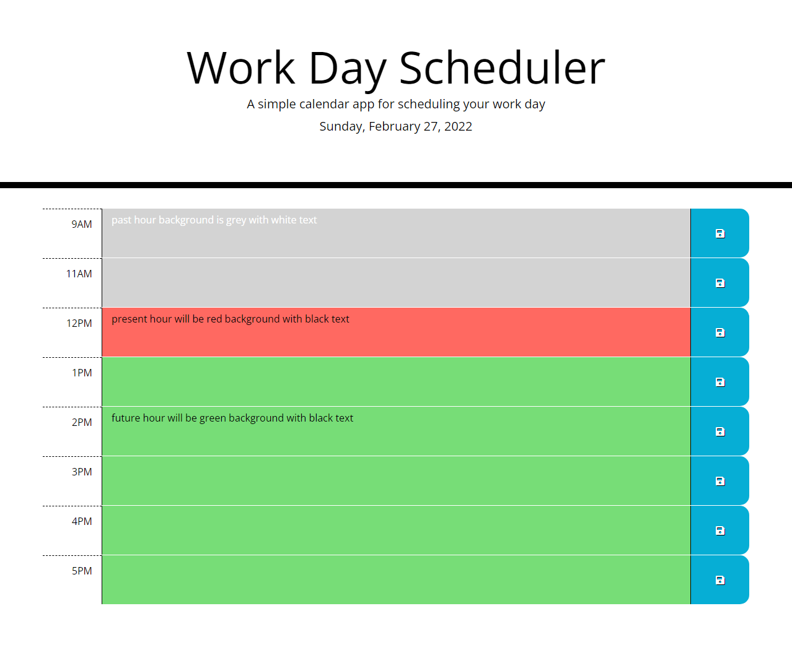

# ⌚Day By Hour
> A "Work Day Schduler" for the organized person

## 📃Instructions
Type out your work day by hour, and click the save button to the right of each to save that to local storage. (*this way if you accidentally close the page or refresh, your schedule will not be lost!*)
The page will dynamically show you which hour block is current by displaying it in red. Anything that has passed, will be in grey and anything in the future will be in green. 

## 🔨Built With
- HTML
- CSS
- JavaScript
- JQuery
- Bootstrap
- Luxon

## 🖥Website
[Day By Hour](https://tneswick.github.io/Day-By-Hour/)

## 📸Screenshot

### ⚙Contribution
*Made By* **[TNeswick](https://github.com/Tneswick/)**